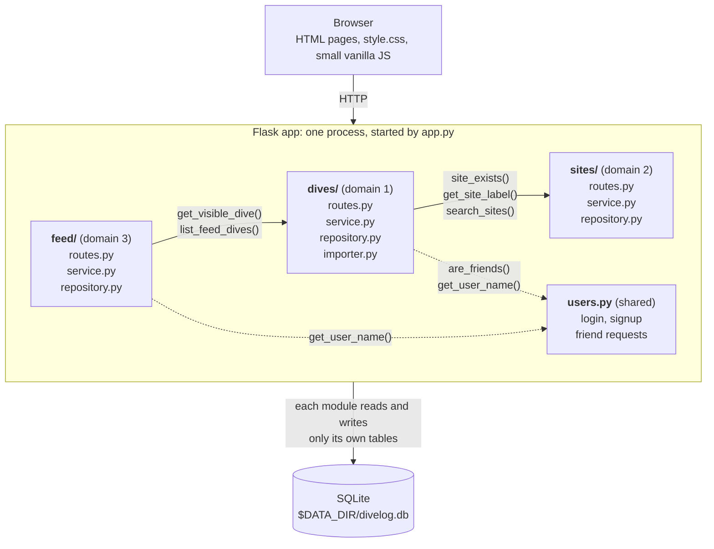
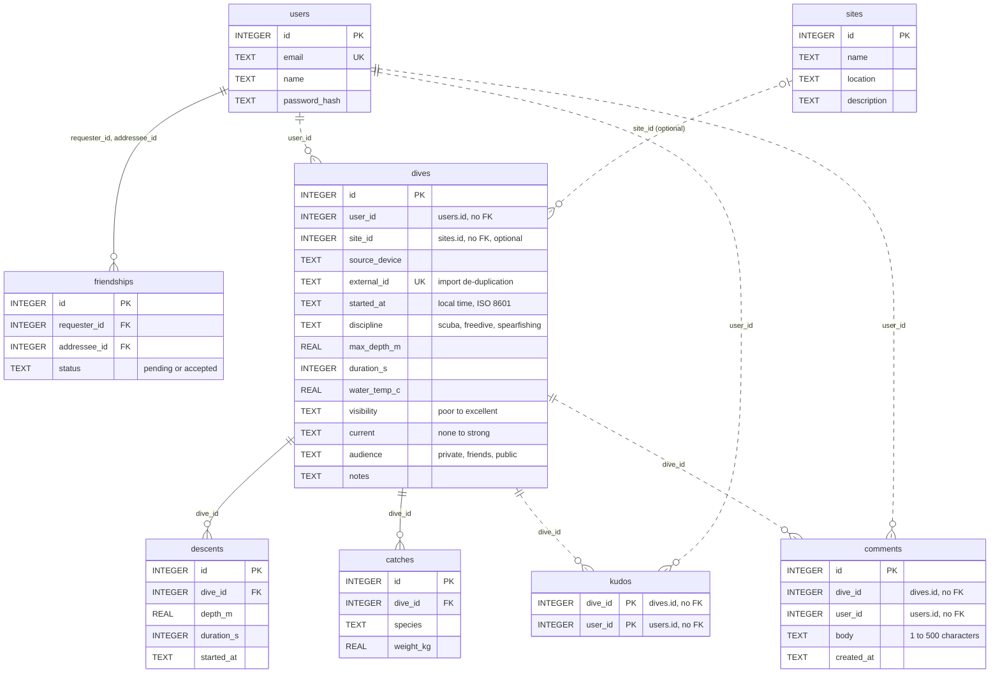

# Dive Log

A Strava-style logbook for scuba divers, freedivers and spearfishers. Log dives by hand
or import them from a dive computer export, tag the site and conditions, and share them
with friends, who can give kudos and comment.

Built as a single-process Flask monolith with one SQLite database (IE University DevOps,
Individual Assignment 1). Design decisions are in [ADR.md](ADR.md), and AI use is logged
in [AI_USAGE.md](AI_USAGE.md).

## Features

- **Dives** (`dives/`)
  - Scuba dives: max depth, duration and water temperature.
  - Freedive and spearfishing **sessions**: you add each descent, and the session's max
    depth and total time are worked out from them.
  - Spearfishing catches: species and weight.
  - Import from a Subsurface CSV export. Re-importing the same file never creates
    duplicates.
  - Optional site, visibility and current on every dive, including imported ones.
  - Who can see each dive: private (the default), friends or public.
- **Sites** (`sites/`): a read-only catalogue of well-known dive sites, with search and
  a page for each site.
- **Feed** (`feed/`): your dives, your friends' dives and everyone's public dives,
  newest first, loading more as you scroll. Kudos (one per person, not on your own dive)
  and comments (up to 500 characters, deletable by their author).
- **Users and friends** (`users.py`): sign up and log in with email and password, and
  send, accept or decline friend requests with a live name search.

## Requirements

- Python 3.13
- [uv](https://docs.astral.sh/uv/)

There are no other services: no external database, cache or network access is needed
at runtime.

## Setup

```bash
git clone https://github.com/Declamski/be-the-fish.git
cd be-the-fish
uv sync
```

`uv sync` installs the dependencies listed in `pyproject.toml` / `uv.lock`, the project's
only dependency manifest. That's Flask at runtime, plus pytest and pytest-cov for
development.

## Run

```bash
uv run python app.py
```

The app starts as a single process on `http://0.0.0.0:8000` and is ready within a few
seconds. Open http://localhost:8000, sign up, and start logging dives.

No setup step is needed. On startup the app creates the data directory, creates every
table with `CREATE TABLE IF NOT EXISTS`, and adds the built-in dive sites.

## Configuration

Everything is configured through environment variables. All of them are optional, and no
`.env` file is needed.

| Variable | Default | What it does |
|---|---|---|
| `PORT` | `8000` | Port the server listens on (always bound to `0.0.0.0`) |
| `DATA_DIR` | `./data` | Folder for the SQLite database. Created if missing. |
| `SECRET_KEY` | `dev-secret-key-change-me` | Signs the login session cookie. Set your own outside local development. |

The database is a single SQLite file at **`$DATA_DIR/divelog.db`**.

Example with a custom port and data folder:

```bash
PORT=9000 DATA_DIR=/tmp/divelog uv run python app.py
```

## Importing dives from a dive computer

The app reads **Subsurface** CSV exports. It doesn't read watch files directly.

1. Open your dive computer's files (e.g. Garmin `.fit`) in [Subsurface](https://subsurface-divelog.org/), a free desktop app.
2. In Subsurface, choose File → Export → CSV summary.
3. In the app, go to **Log a dive → Import a Subsurface CSV** and upload the file.

Rows without a usable date, depth or duration are skipped and counted in the summary.
Imported dives start as private.

## Tests and coverage

Tests use pytest. Each test builds the app on a fresh temporary `DATA_DIR`, so tests
never touch `./data`.

```bash
uv run pytest --cov=dives --cov=sites --cov=feed --cov-report=term-missing
```

Result (128 tests, 2026-10-03):

```
Name                  Stmts   Miss  Cover
-----------------------------------------
dives/__init__.py         2      0   100%
dives/importer.py        66      3    95%
dives/repository.py      39      2    95%
dives/routes.py         134     98    27%
dives/service.py        121      4    97%
feed/__init__.py          2      0   100%
feed/repository.py       32      0   100%
feed/routes.py           66     37    44%
feed/service.py          56      0   100%
sites/__init__.py         3      0   100%
sites/repository.py      16      0   100%
sites/routes.py          20      9    55%
sites/service.py         43      0   100%
-----------------------------------------
TOTAL                   600    153    74%
```

The business logic in each domain's `service.py` (and the importer) is covered at
95–100%. The `routes.py` files are thin glue (read the form, call the service, render a
template) and are covered less. See ADR-4 in [ADR.md](ADR.md).

## Project structure

```
app.py            create_app(): config, database, blueprints; `python app.py` starts the server
config.py         load_config(): reads PORT, DATA_DIR, SECRET_KEY from the environment
db.py             get_connection(), init_db(): creates every domain's tables at startup
users.py          users + friendships tables, login/signup, friend requests
formatting.py     template filters: readable durations, dates and numbers
dives/            domain 1: dives, descents, catches, CSV importer
sites/            domain 2: dive site catalogue
feed/             domain 3: feed, kudos, comments
templates/        Jinja templates, one folder per domain
static/           style.css and small vanilla JS files (live search, infinite scroll)
tests/            pytest tests, one file per service/importer
```

Each domain folder has the same layers:

- `routes.py` reads the request, calls the service and renders the page.
- `service.py` holds the business rules and validation.
- `repository.py` holds the SQL for that domain's own tables.
- `schema.sql` creates those tables.

Domains never query each other's tables. When one domain needs another's data, it calls
a public function in that domain's `service.py`, for example
`sites.service.site_exists()` or `dives.service.get_visible_dive()`. Those calls are the
seams where the app can be split into separate services later.

## Architecture

One Flask process serves every page. Each domain is a blueprint with the same three
layers (`routes.py` → `service.py` → `repository.py`, see *Project structure* above).
The arrows are the **only** calls between domains, labelled with the public functions
used. Each one goes to the other domain's `service.py` (or the shared `users.py`). No
domain imports another domain's `repository.py` or reads its tables. Solid arrows are
domain-to-domain calls; dotted arrows go to the shared `users.py`.



Dependencies only point one way: feed → dives → sites, and feed and dives → users. The
dive page still shows kudos and comments: the browser loads them from
`/feed/dives/<id>/social` (`static/load_fragment.js`), so `dives` never imports `feed`.

## Database schema

All tables live in one SQLite file, created at startup by each domain's schema. A
**solid line** is a real `FOREIGN KEY` between tables of the same domain. A **dashed
line** is a plain integer ID pointing into another domain. It has no foreign key on
purpose, and it is checked through that domain's service instead (ADR-2, ADR-3).

| Owner | Tables |
|---|---|
| `users.py` | `users`, `friendships` |
| `dives/` | `dives`, `descents`, `catches` |
| `sites/` | `sites` |
| `feed/` | `kudos`, `comments` |



A freedive or spearfishing **session** is one `dives` row. Its descents are rows in
`descents`, and the session's `max_depth_m` and `duration_s` are calculated from them
(ADR-3). A scuba dive is one `dives` row with no descents.
